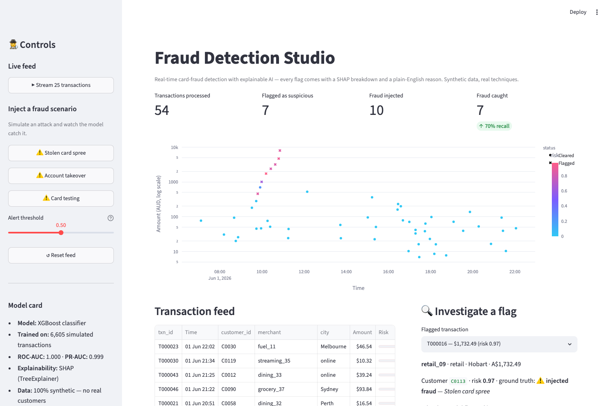

# 🕵️ Fraud Detection Studio

**Real-time card-fraud detection with explainable AI — every flag comes with a SHAP breakdown and a plain-English reason.**

An interactive demo of production fraud-detection techniques: a live synthetic transaction feed is scored by an XGBoost classifier, and every alert can be investigated down to the exact features that drove the decision. Inject classic fraud attacks and watch the model catch them.



## What it shows

- **Real-time scoring** — a simulated card-transaction stream for synthetic Australian customers, scored transaction-by-transaction
- **Explainability** — SHAP waterfall per flagged transaction, plus auto-generated plain-English reasons ("9 transactions in the past hour", "charged 2,700 km from home")
- **Attack simulation** — inject three classic fraud patterns and watch detection happen:
  - *Stolen card spree* — escalating card-present purchases far from home
  - *Account takeover* — late-night online purchases at never-seen merchants
  - *Card testing* — rapid micro-charges to validate a card, then large hits
- **Honest evaluation** — adjustable alert threshold, live recall on injected fraud, false positives visible and labelled

## How it works

```
data_gen.py   →  synthetic customers + transaction simulator + fraud episode injection
                 behavioural features: velocity, distance-from-home, amount-vs-baseline,
                 merchant risk, new-merchant flag, time-of-day
model.py      →  XGBoost classifier trained on simulated history
                 SHAP TreeExplainer + plain-English reason generation
app.py        →  Streamlit UI: live feed, risk scatter, alert investigation
```

The same simulator produces both the training data and the live feed, so feature distributions match. Training data includes deliberate **hard negatives** — legitimate shopping sprees, big-ticket purchases, night-owl online shopping — so the model has to learn behavioural patterns, not just "big amount = fraud".

> **Note on metrics:** the model card reports near-perfect AUC because synthetic fraud patterns are more separable than real-world fraud. The point of this demo is the *detection and explainability workflow*, not benchmark performance.

## Data

All data is **synthetic, generated by [`data_gen.py`](data_gen.py)** — no dataset download, no real customers, no licensing constraints. The simulator's fraud patterns (stolen-card sprees, account takeover, card testing) and feature design (velocity, geo-distance, amount-vs-baseline) are modelled on the patterns found in two widely used public fraud research datasets:

- **PaySim** — synthetic mobile-money transactions: https://www.kaggle.com/datasets/ealaxi/paysim1
- **IEEE-CIS Fraud Detection** — real anonymised card transactions (Vesta Corp.): https://www.kaggle.com/competitions/ieee-fraud-detection

## Run it locally

```bash
git clone https://github.com/drishtantleuva/fraud-detection-studio.git
cd fraud-detection-studio
python3 -m venv venv && source venv/bin/activate
pip install -r requirements.txt
streamlit run app.py
```

macOS users: XGBoost needs OpenMP — `brew install libomp`.

## Disclaimer

All customers, merchants and transactions are synthetically generated. No real financial data is used anywhere in this project.

---

Built by **Drishtant Leuva** — Data Scientist specialising in anomaly detection, risk analytics and explainable GenAI.
[LinkedIn](https://www.linkedin.com/in/drishtant-leuva/) · drishtantl@gmail.com
